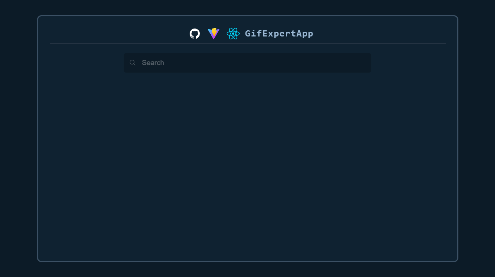
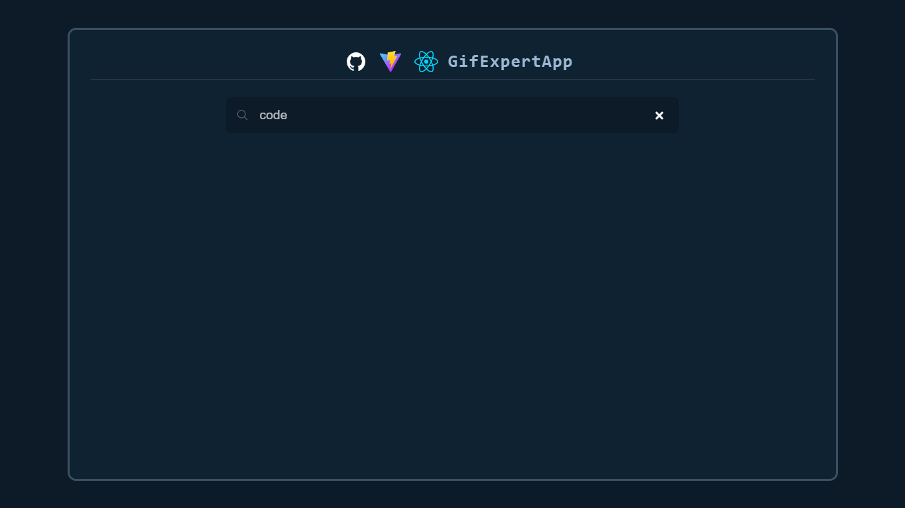
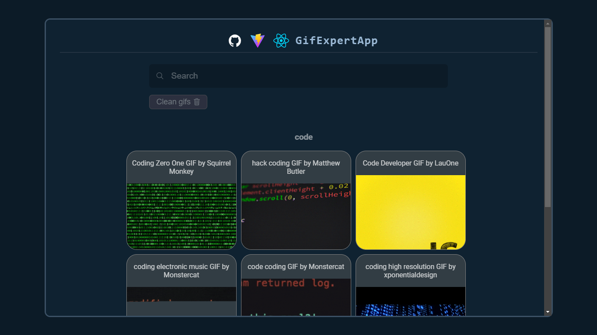
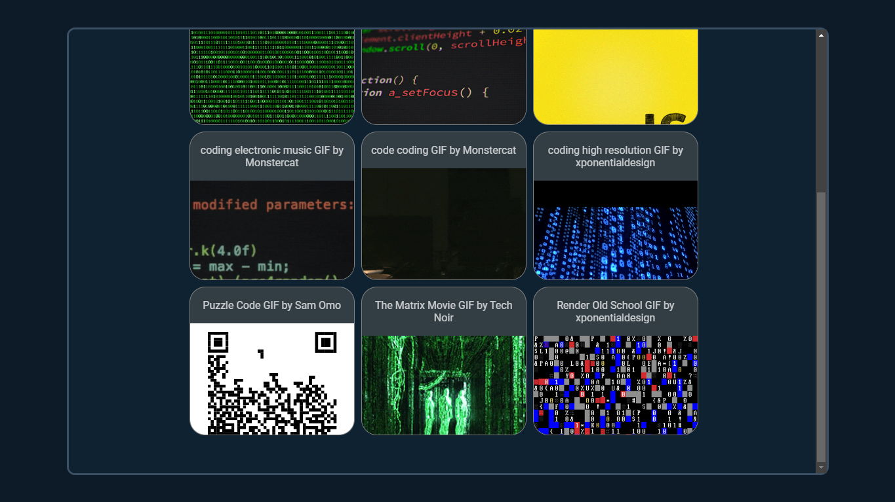

# GifExpertApp

## ⚡ App for practical purposes made with Vite, React and Javascript.

<div align="center">
  
  
  
</div>

## Steps 📌

1. ⬇ You can `clone the repository` or `download` its file *.zip*

```shell
git clone https://github.com/MeeL1ght/search-in-giphy.git
```

2. 📦 Dependencies installation.

```shell
yarn
```

3. 🔎 Go to https://giphy.com/ and Register.

4. ⚠ Create a `.env` file in the root folder.

5. 📄✏ Copy or type your *[api key]* to the `VITE_API_KEY` *environment variable* and the `VITE_GIFS_LIMIT` gifs limit to the `.env` file located in the root folder of the project.

```py
# Environment variables
VITE_HOST=your_host
VITE_PORT=your_port
VITE_API_KEY=giphy_token
VITE_GIFS_LIMIT=number_value
```

6. 🚀 Type `yarn dev`

```shell
yarn dev
```

## UI 🎨





